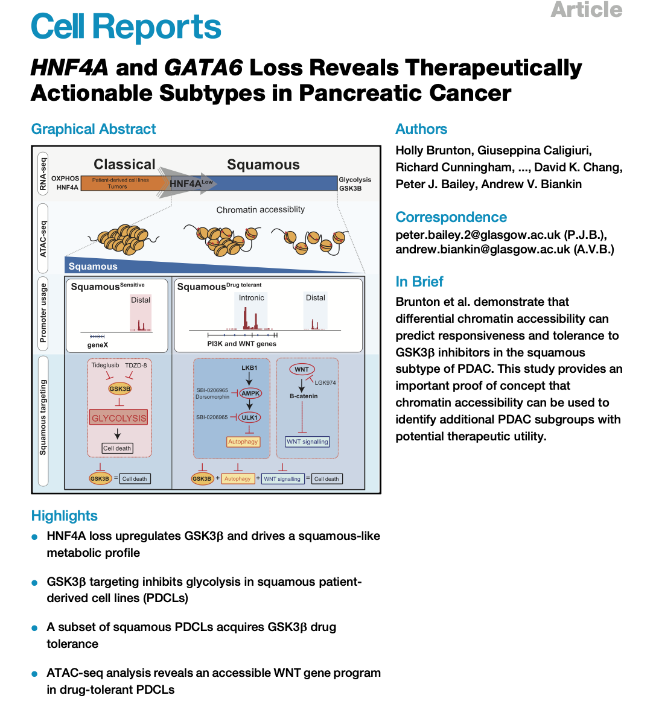

```{r echo = FALSE}
# This block needs cache=FALSE to set fig.width and fig.height, and have those
# persist across cached builds.
source("utils.R", local = TRUE)
```

# RNAseq Analysis - DESeq2

<a href="./course/BruntonBailey.pdf"></a>

In this Chapter, we will be analyzing RNAseq data previously published in [_Brunton et al. HNF4A and GATA6 Loss Reveals Therapeutically Actionable Subtypes in Pancreatic Cancer. Cell Reports 2020_](https://doi.org/10.1016/j.celrep.2020.107625). The RNAseq experiment that we will re-analyse involves the Knock-Down (KD) of HNF4A using a specific siRNA in 2 different Patient Derived Cell Lines (PDCLs) Mayo5289 and TKCC22. Both Mayo5289 and TKCC22 are Classical lines which expresses HNF4A. We have 12 samples in total, representing:

  - 3x Mayo5289 Scrambled Controls (Biological Replicates)
  - 3x Mayo5289 siHNF4A (Biological Replicates)
  - 3x TKCC22 Scrambled Controls (Biological Replicates)
  - 3x TKCC22 siHNF4A (Biological Replicates)
  
RNAseq data has been mapped and a merged counts file is available for us to analyse. Let's take a look at the sample sheet for the experiment.

```{r}
sampleSheet <- read.delim("RNASeqData/SampleSheetBrunton.tsv", sep = "\t", 
                          stringsAsFactors = FALSE)
sampleSheet
```

The merged counts file is in the following format:

```{r}
countsFile <- read.delim("RNASeqData/CountsFileBrunton.tsv", 
                         stringsAsFactors = FALSE, sep = "\t",row.names = 1)
head(countsFile)
```


## DESEq2 package 

The `DESeq2` package expects count data in the form of a matrix of integer values as input. The values in the matrix should be non-normalized counts or estimated counts of sequencing reads (for single-end RNA-seq) or fragments (for paired-end RNA-seq). The `DESeq2` model internally corrects for library size, so transformed or normalized values such as counts scaled by library size should not be used as input. 

The `DESeq2` package stores the read counts and the results of any analysis in an object of class `DESeqDataSet`. The `DESeqDataSet` class extends the `RangedSummarizedExperiment` class of the `SummarizedExperiment` package, which we used previously in Section 4.2. 

## The DESeqDataSet

A `DESeqDataSet` object must have an associated design formula. The design formula expresses the variables which will be used in modeling. The formula should be a tilde (~) followed by the variables with plus signs between them (it will be coerced into an formula if it is not already). 


## Count matrix input

The function `DESeqDataSetFromMatrix` can be used to generate a `RangedSummarizedExperiment` object comprising our data. The `Treatment_group` sample sheet column is used for our design formula!


```{r}
library(DESeq2)
## Produce a DESeq dataset
dds <- DESeqDataSetFromMatrix(countData = countsFile, 
                              colData = sampleSheet, 
                              design = ~ Treatment_group)

```

Let's take a look at the `colData` for this object. The `colData` function will allow us to access the `Treatment_group` and experiment `ids` later on!
```{r}
head(colData(dds))
```


## Pre-filtering

While it is not necessary to pre-filter low count genes before running the `DESeq2` functions, there are two reasons which make pre-filtering useful: 
  - by removing rows in which there are very few reads, we reduce the memory size of the dds data object
  - we increase the speed of the transformation and testing functions within `DESeq2`. 
  
Here we perform a minimal pre-filtering to keep only rows that have at least 10 reads total. Note that more strict filtering to increase power is automatically applied via independent filtering on the mean of normalized counts within the results function.


```{r}
keep <- rowSums(counts(dds)) >= 10
dds <- dds[keep,]
```


## Differential expression analysis

The standard differential expression analysis steps are wrapped into a single function named `DESeq`. 

Results tables are generated using the function `results`, which extracts a results table with log2 fold changes, p values and adjusted p values. Here we want to compare differential gene expression in the TKCC22 and Mayo5289 PDCLs, separately. To do this we can provide a `contrast` argument, where the first vector value is our design name and the other vector values represent the contrast of interest!

```{r warning=FALSE, message=FALSE}
dds <- DESeq(dds)
resTKCC22 <- results(dds, contrast=c("Treatment_group", "TKCC-22_HNF4A", "TKCC-22_Cont"))
head(resTKCC22)
resMayo5289 <- results(dds, contrast=c("Treatment_group", "Mayo_5289_HNF4A", "Mayo_5289_Cont"))
head(resMayo5289)
```


The results are not ordered by _p value_ so let's order the results so that the most significant results are shown at the top of the table.

```{r}
resTKCC22.Ordered <- resTKCC22[order(resTKCC22$pvalue),]
head(resTKCC22.Ordered)
resMayo5289.Ordered <- resMayo5289[order(resMayo5289$pvalue),]
head(resMayo5289.Ordered)
```

## Gene Annotation

To annotate gene names, we will use the `AnnotationDbi` and `org.Hs.eg.db` packages which provide functions to map ensembl Ids to HGNC symbol names. Other annotations are also provided which you can explore.

```{r}
library("AnnotationDbi")
library("org.Hs.eg.db")

columns(org.Hs.eg.db)
```


The following code maps the EnsemblIDs e.g. `ENSG00000223972` to gene symbols and EntrezIds. First we obtain the vector of EnsemblIDs found in our `resMayo5289.Ordered` `data.frame` - EnsemblIDs represent the row names of the `data.frame` and can be obtained using the `rownames()` function. We then use the `mapIds` function to match each EnsemblID to a corresponding gene symbol and assign the results to a new column named `symbol`. 

```{r}
#Extract the EnsemblIds
ensIds <- rownames(resMayo5289.Ordered)
#Map the ensIds
resMayo5289.Ordered$symbol <- mapIds(org.Hs.eg.db,
                     keys=ensIds,
                     column="SYMBOL",
                     keytype="ENSEMBL",
                     multiVals="first")
resMayo5289.Ordered$entrez <- mapIds(org.Hs.eg.db,
                     keys=ensIds,
                     column="ENTREZID",
                     keytype="ENSEMBL",
                     multiVals="first")
head(resMayo5289.Ordered)

resTKCC22.Ordered$symbol <- mapIds(org.Hs.eg.db,
                     keys=ensIds,
                     column="SYMBOL",
                     keytype="ENSEMBL",
                     multiVals="first")
resTKCC22.Ordered$entrez <- mapIds(org.Hs.eg.db,
                     keys=ensIds,
                     column="ENTREZID",
                     keytype="ENSEMBL",
                     multiVals="first")
```

> ***Exercise 6.1***
>
> What do you think the `multiVals` argument in the `mapIds` function is doing? Add additional annotations to the `resMayo5289.Ordered` data.frame.
>


## Exploring the results

At this stage we often want to get a first glimpse of the results. Let's first determine how many genes are differentially expressed in the Mayo5289 cells after KD with HNF4A!

```{r}
#How many genes change significantly between conditions?
sum(resMayo5289.Ordered$pvalue <= 0.05, na.rm=TRUE)
sum(resMayo5289.Ordered$padj <= 0.05, na.rm=TRUE)
#How many are also associated with abs(log2FC) >= 1
sum(resMayo5289.Ordered$padj <=0.05 & abs(resMayo5289.Ordered$log2FoldChange) >= 1, na.rm=TRUE)
```


We might also like to get an idea about the top 10 genes ranked by `padj` and `LogFC`
```{r}
resMayo5289.Ordered <- resMayo5289.Ordered[!is.na(resMayo5289.Ordered$padj), ]
sigGenesMayo5289 <- resMayo5289.Ordered[resMayo5289.Ordered$padj <= 0.05 & abs(resMayo5289.Ordered$log2FoldChange) >= 1, ]
head(sigGenesMayo5289,3)
sigGenesMayo5289$symbol[1:10]
```

> ***Exercise 6.2***
>
> What do you observe? Do the genes at the top of our list make sense?
> 
>

We also might want to compare our HNF4A KD results in both the TKCC22 and Mayo5289 PDCLs? Upset plots are a nice way of comparing the relationship between data sets. The `UpSetR` package provides a simple set of functions to define data set overlap. 

```{r fig.cap="UpSet plot showing the relationship between the TKCC22 and Mayo-5289 experiments", fig.width=5, fig.height=5}
library(UpSetR)
library(ggplot2)
#Set up the Mayo5289 gene list
sigGenesMayo5289 <- resMayo5289.Ordered[resMayo5289.Ordered$padj <=0.05 & abs(resMayo5289.Ordered$log2FoldChange) >= 1, "symbol"]
#Set up the TKCC22 gene list
#Need to remove NAs as above
resTKCC22.Ordered <- resTKCC22.Ordered[!is.na(resTKCC22.Ordered$padj), ]
sigGenesTKCC22 <- resTKCC22.Ordered[resTKCC22.Ordered$padj <=0.05 & abs(resTKCC22.Ordered$log2FoldChange) >= 1, "symbol"]
#Create a list of genes 
listInput <- list(TKCC22 = sigGenesTKCC22 , Mayo5289 = sigGenesMayo5289)
#Create the plot
upset(fromList(listInput), order.by = "freq")
```

<br>

> ***Exercise 6.3***
>
> What are the genes in common? Hint: try the `interesect` function!
>

## Exporting results

Exporting results is straight forward! Results can also be stored in an `.RData` file for later use!
```{r eval=FALSE}
write.csv(as.data.frame(resMayo5289.Ordered), file = "resMayo5289.Ordered_results.csv")
save(dds, resMayo5289.Ordered, resTKCC22.Ordered, file = "PDCL_HNF4A_siRNA_Experiment.RData")
```

## Data transformation and visualisation

For downstream analyses – e.g. for visualization or clustering – we need to work with transformed versions of the count data. There are a number of methods to transform count data provided in the `DESeq2` package and include _variance stabilizing transformations (vst)_ and _regularized logarithm (rlog)_.

Both the `vst` and `rlog` transformations remove the dependence of the variance on the mean, particularly the high variance of the logarithm of count data when the mean is low. The `vst` and `rlog` transformations produce transformed data on the log2 scale which has been normalized with respect to library size and/or other normalization factors. The `assay` function returns the results of the transformation as a matrix of transformed values.
 
```{r}
vsd <- vst(dds, blind=FALSE)
rld <- rlog(dds, blind=FALSE)
head(assay(vsd), 3)
```

### PCA using transformed data

A well-established technique for visualization and extraction of relevant information is the popular Principal Component Analysis (PCA). PCA allows us to determine the relationship between samples and can provide valuable insights into the veracity of the results.

```{r fig.cap="Principal Component Analysis (PCA) plot showing the relationship between the TKCC22 and Mayo-5289 experiments",fig.width=6, fig.height=4}
library(ggplot2)
pcaData <- plotPCA(vsd, intgroup=c("Treatment_group", "Batch"), returnData=TRUE)
percentVar <- round(100 * attr(pcaData, "percentVar"))
ggplot(pcaData, aes(PC1, PC2, color=Treatment_group, shape=as.factor(Batch))) +
  geom_point(size=3) +
  xlab(paste0("PC1: ",percentVar[1],"% variance")) +
  ylab(paste0("PC2: ",percentVar[2],"% variance"))
```

### Heatmaps using transformed data

Using `vsd` transformed data let's generate a heatmap showing a selection of genes that are differentially expressed after HNF4A KD in the Mayo5289 cell line.

```{r warning=FALSE, message=FALSE}
#Looking at the vsd matrix it comprises EnsemblIds and not gene symbols as row names!
head(assay(vsd), 3)
expMatrix <- assay(vsd)
#To make the Heatmap we will select genes based on our significant cutoffs
resMayo5289.Ordered <- resMayo5289.Ordered[!is.na(resMayo5289.Ordered$symbol),]

resMayo5289.select <- subset(resMayo5289.Ordered,
                             padj <= 1e-20 &
                               abs(resMayo5289.Ordered$log2FoldChange) >= 1)
#Map the significant results to the transformed expression values
inter <- intersect(rownames(expMatrix), rownames(resMayo5289.select))
head(inter)
#Subset the matrix to include only the significant genes of interest
expMatrix.select <- expMatrix[inter, ]
dim(expMatrix.select)
head(expMatrix.select)
```

Let's now finish off the matrix by swapping the Ensembl IDs for the gene symbols - this will make our heatmap biologist friendly! We also want to limit the matrix to the Mayo5289 HNF4A KD experiment!

```{r}
#Add human readable gene names
rownames(expMatrix.select) <- mapIds(org.Hs.eg.db,
                     keys=rownames(expMatrix.select),
                     column="SYMBOL",
                     keytype="ENSEMBL",
                     multiVals="first")
head(rownames(expMatrix.select))
#Select the Mayo5289 columns
expMatrix.select <- expMatrix.select[, grepl("Mayo_5289_HNF4A|Mayo_5289_Cont",colData(dds)$Treatment_group)]
#Give the matrix some useful column names
colnames(expMatrix.select) <- colData(dds)[colnames(expMatrix.select),"Treatment_group"]
head(expMatrix.select)
```

We now make the heatmap using the `ComplexHeatmap` package.

```{r fig.cap="Heatmap showing differentially expressed genes in Mayo-5289 after HNF4A KD", fig.width=5, fig.height=7}
library(ComplexHeatmap)
library(circlize)
#Define some colours for the annotation
colors <- RColorBrewer::brewer.pal(8, "Set1")
#Make the sample annotation track
ha <- HeatmapAnnotation(Treatment = colnames(expMatrix.select),
                        col = list(Treatment = structure(names = c(
                          "Mayo_5289_Cont", "Mayo_5289_HNF4A"
                        ), colors[3:4])))
#Scale the matrix to generate z-scores
expMatrix.select.sc <- t(scale(t(expMatrix.select)))
#Generate the heatmap
Heatmap(
  expMatrix.select.sc,
  col = colorRamp2(c(-2, 0, 2), c("#377EB8", "white", "#E41A1C")),
  name = "Z score",
  cluster_columns = TRUE,
  cluster_rows = TRUE,
  top_annotation = ha,
  show_row_names = TRUE,
  show_column_names = FALSE, #Turned off column names
  row_names_gp = gpar(fontsize = 5),
  column_names_gp = gpar(fontsize = 5)
)
```


## Gene Set Enrichment Analysis

Over-representation and/or Gene Set Enrichment Analysis (GSEA) are essential tasks in any RNAseq study. These analyses help to define biological functions and/or processes that are enriched in different biological samples. In this section we will use the `clusterProfiler` package to perform over-representation analysis to determine whether known biological functions or processes are over-represented (= enriched) in an experimentally-derived gene list, e.g. a list of differentially expressed genes (DEGs). A comprehensive overview of the theory and methods used in this section is provided at the following location [clusterProfiler-book](http://yulab-smu.top/clusterProfiler-book/) or by typing `browseVignettes("clusterProfiler")` at the R prompt. Please read through the `clusterProfiler` documentation.

First load the `clusterProfiler` library into the current environment.
```{r}
library(clusterProfiler)
```

For over-representation analysis, we require a vector of gene IDs. These gene IDs can be obtained by differential expression analysis (e.g. with the `DESeq2` package). The functions that we will be using require Entrez IDs as input. We define a vector of significantly and differentially expressed Entrez IDs (genes) defining our experiment as follows:

```{r}
resMayo5289.enriched <- subset(resMayo5289.Ordered,
                               padj <= 0.05)
```

### KEGG

KEGG (Kyoto Encyclopedia of Genes and Genomes) is a collection of databases dealing with genomes, biological pathways, diseases, drugs, and chemical substances. Our analysis will determine whether our experimentally derived gene list is enriched in any one of the curated gene sets defined by KEGG. To do this we will use the `enrichKEGG` function. 

```{r}
#Perform the over-representation analysis using keggEnrich
keggEnrich <- enrichKEGG(gene = resMayo5289.enriched$entrez,
                         organism     = 'hsa',
                         pvalueCutoff = 0.05)
head(keggEnrich)
#Make the output biologist friendly 
keggEnrichRead <-
  setReadable(keggEnrich, OrgDb = org.Hs.eg.db, keyType = "ENTREZID")
head(keggEnrichRead, 55)
```

### REACTOME

Like KEGG, the REACTOME database contains curated gene set annotations covering diverse molecular and cellular biology pathways. Similarly, our analysis will determine whether our experimentally derived gene list is enriched in any one of the curated gene sets defined by REACTOME. To do this we use the `enrichPathway` function provided by the `ReactomePA` package.

```{r}
library(ReactomePA)
reactomeEnrich <- enrichPathway(
  gene = resMayo5289.enriched$entrez,
  organism = "human",
  pvalueCutoff = 0.05,
  pAdjustMethod = "BH",
  qvalueCutoff = 0.2,
  minGSSize = 10,
  maxGSSize = 500,
  readable = TRUE
)
head(reactomeEnrich, 5)
```

### Plotting functions

Once we have our results, we would like to generate publication quality figures. The `clusterProfiler` and `enrichPlot` packages provide a number of plotting functions that make this easy.

**Dotplot**

```{r fig.cap="Dotplot showing KEGG and REACTOME pathways that are significantly enriched.", fig.width=15, fig.height=10}
library(enrichplot)
plot1 <- dotplot(keggEnrich, showCategory = 10) + ggtitle("KEGG")
plot2 <-
  dotplot(reactomeEnrich, showCategory = 10) + ggtitle("REACTOME")
plot_grid(plot1, plot2, ncol = 2)
```

**Upset plot**

An `upsetplot` shows the overlap of genes comprising different gene sets and provides a complex overview of genes and gene sets significantly enriched in the experiment.

```{r fig.cap="UpSet plot showing the overlap of genes comprising significantly enriched processes and pathways.", fig.width=10, fig.height=5}
upsetplot(reactomeEnrich) 
```


**Enrichment map plot**

An enrichment map plot `emapplot` generates a network of significantly enriched gene sets with edges connecting overlapping gene sets.

```{r fig.cap="Enrichment map of Reactome pathways significantly enriched.", fig.width=10, fig.height=7}
emapplot(reactomeEnrich)
```

### Extracting enrichment results to generate heatmaps

The above analysis showed that our experimentally derived gene list is significantly enriched in the "Transcriptional Regulation by TP53" REACTOME gene set. Because we have selected genes that are both up and down regulated following HNF4A KD, we would like to understand how specific genes, within this pathway, are modulated by HNF4A. A heatmap is an informative way of determining the relative expression of sets of genes, so let's generate a heatmap using the set of genes comprising this pathway. First, we need to get the data into the correct shape as follows:

```{r}
slotNames(reactomeEnrich)
reactResults <- reactomeEnrich@result
tp53genes <- subset(reactResults,
                    Description == "Transcriptional Regulation by TP53")$geneID
tp53genes.vector <- strsplit(tp53genes, "/")[[1]]
expMatrix <- assay(vsd)
rownames(expMatrix) <- mapIds(
  org.Hs.eg.db,
  keys = rownames(expMatrix),
  column = "SYMBOL",
  keytype = "ENSEMBL",
  multiVals = "first"
)
#Map the significant results to the transformed expression values
inter <- intersect(rownames(expMatrix), tp53genes.vector)
expMatrix.tp53 <- expMatrix[inter,]
#Add human readable gene names
expMatrix.tp53 <- expMatrix.tp53[, grepl("Mayo_5289_HNF4A|Mayo_5289_Cont",
                         colData(dds)$Treatment_group)]
#Give the matrix some useful column names
colnames(expMatrix.tp53) <-
  colData(dds)[colnames(expMatrix.tp53), "Treatment_group"]
```

>
>
> Notice that we have used the `strsplit` function to split the character string `tp53genes` into a vector of gene symbols!
>
>

Now produce the heatmap using the `ComplexHeatmap` package:

```{r fig.cap="Heatmap showing differentially expressed genes in the `Transcriptional Regulation by TP53` Reactome pathway", fig.width=5, fig.height=7}
#Setup the annotation showing treatment type
ha <- HeatmapAnnotation(Treatment = colnames(expMatrix.tp53),
                        col = list(Treatment = structure(
                          names = c("Mayo_5289_Cont", "Mayo_5289_HNF4A"), colors[3:4]
                        )))
#Scale the matrix to generate z-scores
expMatrix.tp53.sc <- t(scale(t(expMatrix.tp53)))
#Generate the heatmap
Heatmap(
  expMatrix.tp53.sc,
  col = colorRamp2(c(-2, 0, 2), c("#377EB8", "white", "#E41A1C")),
  name = "Z score",
  cluster_columns = TRUE,
  cluster_rows = TRUE,
  top_annotation = ha,
  show_row_names = TRUE,
  show_column_names = FALSE,
  #Turned off column names
  row_names_gp = gpar(fontsize = 5),
  column_names_gp = gpar(fontsize = 5)
)
```

