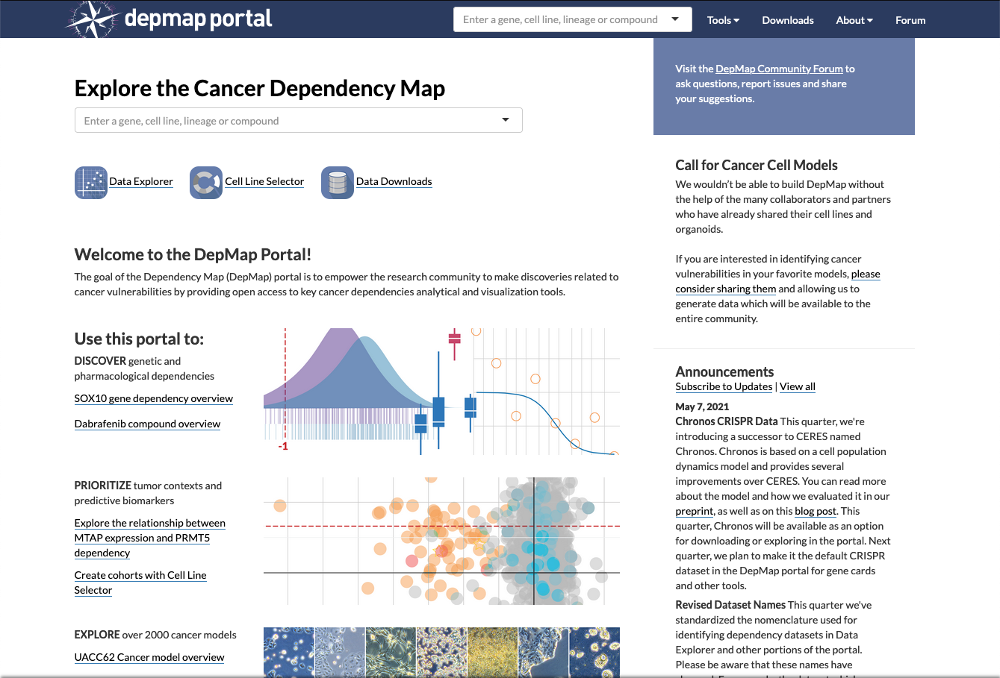

```{r echo = FALSE}
# This block needs cache=FALSE to set fig.width and fig.height, and have those
# persist across cached builds.
source("utils.R", local = TRUE)
```

# Cancer Dependency Map  - DepMap

<a href="https://depmap.org/portal/"></a>

**Chapter 7** will explore the Cancer Dependency Map or DepMap data resource. DepMap provides a comprehensive set of data including genomic information and screening data for gene and small molecule perturbations across hundreds of cancer cell line models. By triangulating information from these and other large-scale datasets, the hope is to define a landscape of genetic targets for therapeutic development, identify patients who respond to these therapies, and develop a better understanding of the vulnerabilities of cancer. 

## Downloading DepMap data using the `depmap` package 

DepMap data can downloaded directly from the DepMap data portal website. Alternatively, DepMap data can be downloaded from within R using the Bioconductor package `depmap`. 

`depmap` provides easy access to datasets from the most current DepMap release, including RNAi and CRISPR-Cas9 gene knockout screens quantifying the genetic dependency for select cancer cell lines. 

Additional datasets are also available including log copy number of genes for select cell lines, protein expression of cell lines as measured by reverse phase protein lysate microarray (RPPA), 'Transcript Per Million' (TPM) data, as well as supplementary datasets which contain metadata and mutation calls for the other datasets found in the current release. 

The 19Q3 release adds the drug_dependency dataset, that contains cancer cell line dependency data with respect to drug and drug-candidate compounds. 

The 20Q2 release adds the proteomic dataset that contains quantitative profiling of proteins via mass spectrometry.


First install the `depmap` package as follows:

```{r eval=FALSE}
BiocManager::install("depmap")
```

Load the `depmap` and `ExperimentHub` libraries into your working environment:

```{r}
library("depmap")
library("ExperimentHub")
```

First we create an ExperimentHub object called `eh` and  generate a query using the `depmap` argument to obtain a list of DepMap data that are available for download:

```{r}
eh <- ExperimentHub()
query(eh, "depmap")
```

To retrieve a dataset of interest we can simply use the name of the list element. For example, let's obtain the DepMap transcriptomic data as follows:

```{r cache=TRUE, cache.lazy = FALSE}
TPM <- eh[["EH6120"]]
head(TPM)
```

We can also obtain detailed information about each of the cell lines by downloading the metadata:

```{r cache=TRUE, cache.lazy = FALSE}
metaData <- eh[["EH6122"]]
head(metaData)
```


We might for instance be interested in obtaining the lineage of each cell line:

```{r}
lineages <- metaData %>% select(lineage) %>% unique()
lineages$lineage
```


Have you noticed a new way of coding? We are using the `dplyr` package. What are these `%>%` functions? `%>%` functions are pipes that allow us to pass data from one function to another without the hassle of assigning multiple objects.

The `dplyr` package includes a number of extremely useful functions that allow us to join different tables and integrate related datasets!

## Exploring DepMap transcriptomic data

What if we are interested in examining GATA6 expression across cancer cell lineages? How can we achieve this? Firstly, we notice that the lineage specific information is found in the `metaData` object while the gene expression data is located in the `TPM` object. We can join the tables using the `dplyr::full_join` function as follows:

```{r cache=TRUE, cache.lazy = FALSE}
expBylineage <- metaData %>% dplyr::select(depmap_id, lineage) %>% dplyr::full_join(TPM, by = "depmap_id") 
head(expBylineage)
```

To extract GATA6 gene expression data we can use the `dplyr::filter()` function:
```{r cache=TRUE, cache.lazy = FALSE}
gata6Bylineage <- expBylineage %>% dplyr::filter(gene_name == "GATA6")
head(gata6Bylineage)
```

Using the descriptive plotting skills that you learned in **Chapter 4** generate a boxplot to determine whether GATA6 gene expression is specifically enriched in a cell line lineage.

```{r fig.cap="Boxplot of GATA6 expression (TPM) by cell lineage", fig.width=10, fig.height=10}
library(ggpubr)
ggboxplot(gata6Bylineage, x = "lineage", y = "rna_expression",
          title = "GATA6 Expression by Cell Line Lineage", ylab = "Expression (TPM)",
          color = "lineage") + rotate_x_text()
```


We might also be interested in the relative expression of GATA6 in different Pancreatic Cancer cell lines. We can generate a barplot to show the relative expression levels as follows:


```{r}
gata6BylPancreas <- gata6Bylineage %>% filter(lineage=="pancreas")
gata6BylPancreas %>% head()
```


Generate a barplot using the `ggbarplot` function with expression values plotted in descending order:

```{r fig.cap="Barplot of GATA6 expression (TPM) in Pancreatic Cancer Cell lines", fig.width=10, fig.height=5}
ggbarplot(gata6BylPancreas, x = "cell_line", y="rna_expression", 
          fill = "seashell3", sort.val = "desc",
          title = "GATA6 Expression in Pancreatic Cancer Cell lines", ylab = "Expression (TPM)",
          xlab = "Pancreatic Cancer Cell Lines ") + rotate_x_text()
```

## Exploring DepMap mutation calls

First, let's extract the 21Q2 DepMap mutation calls:

```{r cache=TRUE, cache.lazy = FALSE}
mutData <- eh[["EH6121"]]
```


```{r}
mutBylineage <- metaData %>% dplyr::select(depmap_id, lineage, cell_line_name) %>% dplyr::full_join(mutData, by = "depmap_id") 
head(mutBylineage)
```


The `maftools` package provides a number of useful functions for exploring and analyzing mutation calls. Before we can use maftools we need to modify some of the column names.

```{r}
mutBylineageRename <- mutBylineage %>% rename(Hugo_Symbol=gene_name) %>% rename(Start_Position=start_pos) %>% rename(End_Position=end_pos) %>%
  rename(Variant_Classification=var_class) %>% rename(Variant_Type=var_type) %>% rename(Reference_Allele=ref_allele) %>% 
  rename(Tumor_Seq_Allele2 = tumor_seq_allele1) %>% rename(Tumor_Sample_Barcode = cell_line_name)
```


Create a mafObject using our renamed table:

```{r}
library(maftools)
mafObject <- read.maf(mutBylineageRename, rmFlags = TRUE)
```

Subset the mafObject to select only pancreatic cell lines and genes that are know pancreatic cancer drivers.

```{r}
drivers <- c("TP53,SMAD4,KRAS,RNF43,ARID1A,CDKN2A,TGFBR2,ACVR1B,KDM6A,MLL3,ACVR2A,SMARCA4,MAP2K4,SMAD3,RBM10,SF3B1,MARK2,TGFBR1,SDK2,PBRM1,U2AF1,FBXW7,ATM,TP53BP2,CALD1,BCORL1,FBLN2,PLXNB2,SIN3B,MACF1,DISP2,KALRN,ITPR3,HIVEP1,MYCBP2,NF2,SETD2,SPTB,NBEA,TLE4,JAG1,BRCA1,BRCA2,RPA1,PALB2")

drivers <- unlist(strsplit(drivers, ",")[[1]])

mafPanc <- subsetMaf(mafObject, query="lineage == 'pancreas'", genes = drivers)

mafPanc
```

Plot a summary of the mutation calls:

```{r fig.cap="Summary of mutations found in Pancreatic Cancer Cell Lines", fig.width=10, fig.height=6}
plotmafSummary(maf = mafPanc, rmOutlier = TRUE, addStat = 'median', dashboard = TRUE, titvRaw = FALSE)
```


Generate an oncoplot of the top 20 mutations:

```{r fig.cap="Summary of mutations found in Pancreatic Cancer Cell Lines", fig.width=10, fig.height=7}
oncoplot(maf = mafPanc, top = 20, showTumorSampleBarcodes = TRUE, SampleNamefontSize = 0.5)
```


## Exploring DepMap CRISPR data

```{r cache=TRUE, cache.lazy = FALSE}
crispData <- eh[["EH6118"]]
head(crispData)
```

Join with metadata.

```{r}
crispBylineage <- metaData %>% dplyr::select(depmap_id, lineage) %>% dplyr::full_join(crispData, by = "depmap_id") 
head(crispBylineage)
```

Filter to select GATA6 and Pancreatic Cancer Cell Lines

```{r}
gata6CrispPanc <- crispBylineage %>% dplyr::filter(gene_name == "GATA6") %>% dplyr::filter(lineage == "pancreas")
head(gata6CrispPanc)
```

Join GATA6 Expression and GATA6 CRISPRi tables to obtain final table.

```{r}
gata6CrispExpPanc <- gata6CrispPanc %>% dplyr::full_join(gata6BylPancreas, by = "depmap_id") 
```


Generate a Scatter Plot using the `ggscatter` function with added labels.

```{r warning=FALSE, message=FALSE, fig.cap="GATA6 Expression versus CRISPRi Dependency in Pancreatic Cancer Cell Lines", fig.width=5, fig.height=5}
ggscatter(gata6CrispExpPanc, x = "dependency", y = "rna_expression", size = 0.6, 
          rug = TRUE, # Add marginal rug
          add = "reg.line",  label = "cell_line.x", 
          repel = TRUE,
          font.label = list(size = 9, face = "italic"),
          ylab = "GATA6 Expression (TPM)",
          xlab = "GATA6 CRISPRi Dependency"
          )
```

Generate a Scatter Plot using the `ggscatter` function showing only those cell lines that have high GATA6 gene expression and GATA6 dependency. Let's also determine the significance of the correlation.

```{r warning=FALSE, message=FALSE, fig.cap="GATA6 Expression versus CRISPRi Dependency in Pancreatic Cancer Cell Lines", fig.width=5, fig.height=5}
label.select.criteria <- list(criteria = "`dependency` < -0.2 & `rna_expression` >= 3")

ggscatter(gata6CrispExpPanc, x = "dependency", y = "rna_expression", size = 0.6, 
          rug = TRUE,
          label.select = label.select.criteria, 
          font.label = list(size = 9, face = "italic"),
          add = "reg.line",  label = "cell_line.x", repel = TRUE,
          cor.coef = TRUE, 
          cor.coeff.args = list(method = "pearson", label.x = 0.25, label.sep = "\n"),
          ylab = "GATA6 Expression (TPM)",
          xlab = "GATA6 CRISPRi Dependency")
```

